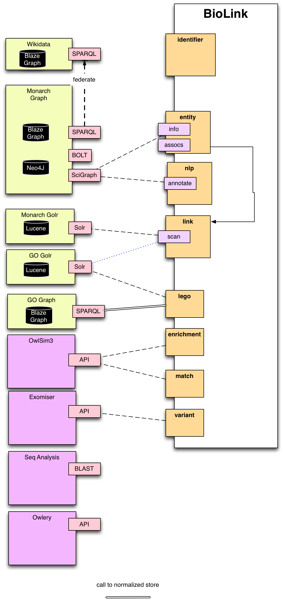

# Biolink API

## Setting up

```
$ pyvenv venv
$ source venv/bin/activate
$ pip install -r requirements.txt
$ export PYTHONPATH=.:$PYTHONPATH
$ python biolink/app.py
```

to run:

```
python biolink/app.py
```

Then look at:

http://localhost:8888/api/

For the swagger docs

Note that only a small subset has been implemented

## Goals

This API will wrap and integrate number of different more modular APIs
and database engines or analysis services. The idea is that the API
implementation will do the right thing - for example, using Solr for
searches but injecting results with fast in-memory traversal of
ontology graphs.

This is a proof of concept implementation. May be implemented using a JVM language, e.g. scala in future.

## Overview

The API is intended to be as self-explanatory as possible, via
swagger/openapi annotations. Please consult these (you will need to
start your own server)



### Example API calls

All assocations, first 10:

http://localhost:8888/api/link/search/

Query association by ID:

http://localhost:8888/api/link/cfef92b7-bfa3-44c2-a537-579078d2de37

Evidence graph as bbop-graph:

http://localhost:8888/api/evidence/graph/cfef92b7-bfa3-44c2-a537-579078d2de37

Evidence graph as image:

http://localhost:8888/api/evidence/graph/cfef92b7-bfa3-44c2-a537-579078d2de37/image

## Notes

May bear some traces of where the code was initially copied from:
http://michal.karzynski.pl/blog/2016/06/19/building-beautiful-restful-apis-using-flask-swagger-ui-flask-restplus/
